# Welcome to my *GitHub Page*.

I am a someone for sure >.> Web Frontend and Minecraft, Team Fortress 2.
  

### My games and apps:
| Name | Stats |
| ----------- | ----------- |
| Unfortunatelly Only Closed Projects atm | |

### My Minecraft mods:
| Name | Stats |
| ----------- | ----------- |
| Unfortunatelly Only Closed Projects atm | |

### My Minecraft Resource packs:
| Name | Stats |
| ----------- | ----------- |
| Trumpet Skeleton - replaces bows with trumpets - *Doot!* |  |
| Spyglass into Binoculars - self explanatory              |  |

### Github Activity:

  -----
   
  
  
   
  
  
  
  

#### My "text" logo made with this:

