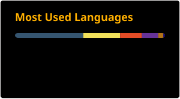

# Welcome to my *GitHub Page*.

I am a someone for sure >.> Web Frontend and Minecraft, Team Fortress 2.
  

My favourite games:
* [Team Fortress 2](https://store.steampowered.com/app/440/Team_Fortress_2/)
* [White Knuckle](https://store.steampowered.com/app/3195790/White_Knuckle/)
* Minecraft (I disagree with update direction ever since covid but I won't deny its awesome game. Modding is keeping it afloat)
* [Ultrakill](https://store.steampowered.com/app/1229490/ULTRAKILL/)

My current addictions:
* [White Knuckle](https://store.steampowered.com/app/3195790/White_Knuckle/)
* [Deadlock](https://store.steampowered.com/app/1422450/Deadlock/)

### My Hytale mods:
| Name | Stats |
| ----------- | ----------- |
| Gibb's missing furniture |  |

### My Minecraft stuff:
| Name | Stats |
| ----------- | ----------- |
| Trumpet Skeleton - replaces bows with trumpets - *Doot!* |  |
| Spyglass into Binoculars - self explanatory              |  |
| RecipeBook+ - Changes the default behavior of the vanilla recipe book to introduce QoL features and improve it | <a href="https://modrinth.com/mod/recipe-book-plus"> [![Modrinth](https://img.shields.io/badge/dynamic/json?labelColor=black&color=grey&label=&suffix=%20downloads&query=downloads&url=https://api.modrinth.com/v2/project/BdJhqYB1&style=flat&logo=)](https://modrinth.com/mod/recipe-book-plus)</a> |

### Github Activity:

  -----
   
  
  
   
  
  
  
  

#### My "text" logo made with this:

